## 配置要求、光敏性癫痫警告、网站/联系我们

### 最低配置

- 操作系统：Windows 10 或 8.1 64 位
- 处理器：Intel i3-2100 / AMD Athlon 200GE
- 内存：4 GB
- 显卡：Nvidia GeForce GT 950
- 存储：2 GB 可用空间
- 声卡：兼容 DirectX 的声卡

### 推荐配置

- 操作系统：Windows 10 或 8.1 64 位
- 处理器：4 核 Intel / AMD CPU (Intel i3-8100 / AMD Ryzen 3 1200)
- 内存：8 GB
- 显卡：Nvidia GeForce GTX 1070
- 存储：2 GB 可用空间
- 声卡：兼容 DirectX 的声卡

### 光敏性癫痫警告

即使没有此类病史，一小部分人仍容易发作光敏性癫痫。当您出现视力改变、眼或面部痉挛、头晕、意识丧失、
迷失方向甚至抽搐时，应立即停止游戏并咨询医生。

尽管如此，作为预防性措施，请坐在距离屏幕尽可能舒适的位置，并在光线充足的条件下游戏，疲惫时请停止游戏并休息。

### 网站/联系我们

- Game/Developer: <http://koshutin.com/>
- Publisher: <https://www.microprose.com/games/highfleet>
- Discord: <https://discord.com/invite/xyWqGak>
- Twitter: <https://twitter.com/micro_prose>

## 键位表

### 地图界面键位

- `Esc` - 暂停菜单（退出/载入存盘点）
- `鼠标滚轮` - 放大/缩小
- `鼠标移动` - 移动地图
- `Shift` - 时间加速
- `空格` - 暂停/继续

### 着陆键位

- `Esc` - 暂停菜单（重试/退出/载入存盘点）
- `Shift` - 激活加力
- `Q` / `E` - 逆时针/顺时针旋转飞行器
- `W` - 向上推进
- `A` / `D` - 向左/右平移飞行器

### 战斗键位

- `Esc` - 暂停菜单（重试/退出/载入存盘点）
- `Q` / `E` - 逆时针/顺时针旋转飞行器
- `W` / `S` / `A` / `D`- 向上/下/左/右推进
- `Shift` - 激活加力
- `R` - 切换弹药种类（如果可用）/（仅在航母攻击时）命令飞机撤退
- `T` - 弃船
- `F` - 抛洒热焰诱饵（如果可用）
- `X` - 起飞飞机（操作航母时）
- `C` - 发射防空导弹（如果可用）
- `B` - 激活灭火系统（如果可用）
- `空格` - 发射反舰导弹（如果可用）

## [格瑞特][Gerat]简史

### 毁灭

[大灾变][Catastrophe]发生于何时？那之前世界又是什么模样？任何可靠的信息早已荡然无存。如果你相信[埃塞][Isi]部落的[穆阿利斯][Mualis]的说法，它发生于一百年前。而根据著名的[萨勒姆][Salem]史学家[伊利亚][Iliya]的研究，大灾变至少也是距我们一千年，甚至两千年前的事了。

但所有人都认同这一事实：大灾变源自天空。[罗姆][Romani]史学家称我们的祖先粉碎了传说中朗照全[埃拉特][Elaat]之月：[卡鲁][Kharu]，其碎片坠落，带来了无数巨大的撞击坑和一道能量可怖的电磁脉冲，脉冲席卷世界，旧世界那些机器的大脑被其尽数焚毁，存于其内的学识也无一幸免。

为何我们的先祖作出如此举动？史学家对此说法不一，自相矛盾，真正的答案则不得而知。

### [罗姆帝国][Romani Empire]

当代史与现代历法均起源于 214 年前，即王朝初创之年。[萨亚迪][Sayadi]公爵被[大贵族][Great Houses]推举为罗姆人民的世袭君主，肩负起战争与舰队的重大权责。在萨亚迪家族延续两个世纪至今的统治里，罗姆帝国发展成为[埃拉特][Elaat]最强大的国家。

### 兼并[格瑞特][Gerat]

36 年前，为了取得对[可汗][Khans]战争的胜利，格瑞特国王[埃劳 · 阿里][Elaou-Ali]向[罗姆帝国][Romani Empire]皇帝[克里姆沙阿二世][Kerim Shah II]宣誓效忠。罗姆帝国舰队抹去了可汗的部队，为被战火笼罩无数个年头的格瑞特带来了和平。

### [希瓦][Khiva]叛乱

[格瑞特][Gerat]近 30 年的和平在 207 年末戛然而止。一位晋升至希瓦总督的帝国官员突然揭竿而起，推翻了国王[阿里][Elaou-Ali]，对[萨亚迪][Sayadi]王朝掀起叛旗。在[大贵族会盟][the Gathering of Great Houses]加入起义后，这位总督宣布，从此，格瑞特王国成为共和国。

### [会盟战争][the Gathering War]

早在[希瓦][Khiva]叛离帝国前，[萨亚迪][Sayadi]王朝与[大贵族][Great Houses]之间的内讧就已愈益恶化。帝国陆军与舰队也已准备着即将到来的大规模冲突。但是，所有人都低估了帝国面临的危机。面对大贵族数量庞大的地面联合部队，帝国陆军捉襟见肘，节节败退。如今，只有舰队挡在[会盟][the Gathering of Great Houses]与首都之间。

正当叛军主力在[罗姆帝国][Romani Empire]腹地战斗时，帝国舰队伺机派出了一支远征部队，希望藉此奇兵一举拿下希瓦。

这只部队的任务十万火急——据传，希瓦已经拥有一座正常运转的核反应堆。尽管太过荒谬，这消息依然在舰队司令部的每个人心中埋下了恐惧。迄今为止，世界上能够工作的反应堆仅有两座。一旦希瓦设法获得了第三座，[埃拉特][Elaat]脆弱的实力平衡将悬于一线。

## 手册简介

您好，英勇的[答剌罕][Tarkhan]。

我是您的新副官，[贾基尔][Jharkil]。很荣幸为您介绍这些您在[高空舰队][HighFleet]取得辉煌胜利所必需的工具。

您将执行的任务是危险的，但也是正义且值得骄傲的。

我们将一同探索高空舰队的方方面面，直到您能自信地运用您日益精进的技能，来统领我们伟大帝国雄伟的舰队。

## 主菜单

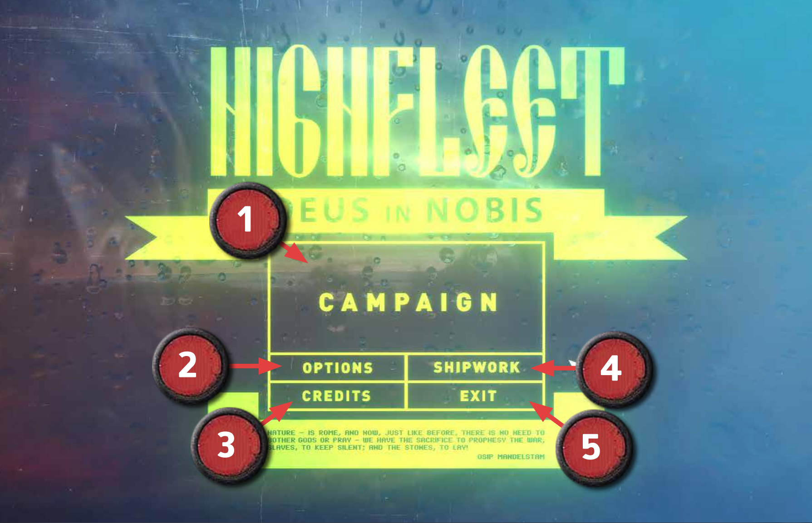

1. **战役** - 单击打开战役子菜单，开始新战役或读取存档。
2. **设置** - 单击打开设置子菜单。
3. **鸣谢** - 查看游戏开发者。
4. **舰船编辑** - 打开舰船编辑器，创造并测试自定义舰船，舰船可以在战役中购买。详见[舰船编辑器](#舰船编辑器)。
5. **退出** - 让你的家族永远蒙羞，懦夫。

### 设置子菜单

> 译注：此处为 1.0 版菜单

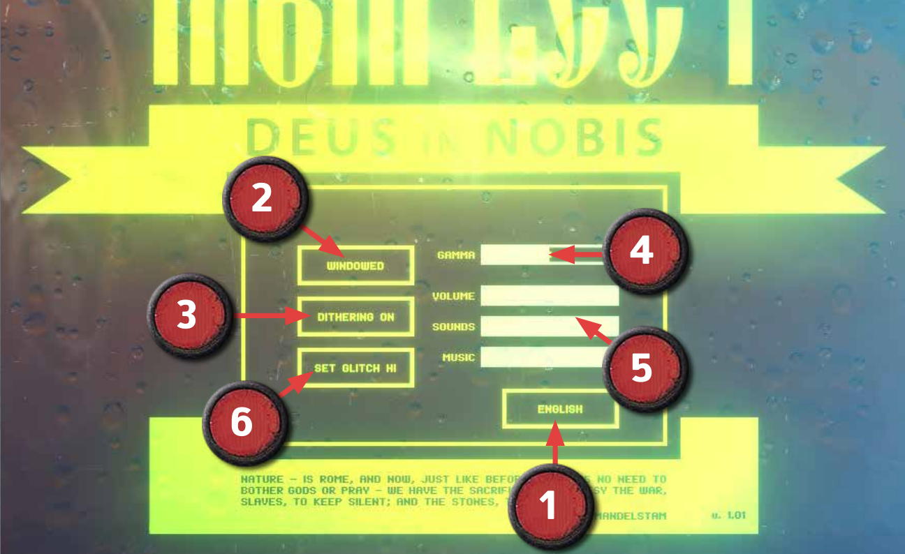

1. **语言选择** - 单击切换英语或俄语。
2. **显示模式** - 单击切换窗口化或全屏显示。
3. **抖动效果** - 单击切换正常清晰或带颗粒效果的画面，后者更能衬托您战斗之艰难困苦。此选项对录屏所需空间影响较大。
4. **伽马** - 拖动调整屏幕亮度。
5. **音量控制** - 拖动可分别调整总体音量、音效、和音乐音量。
6. **花屏特效等级** - 可选择大量或少量花屏特效。

### 战役子菜单

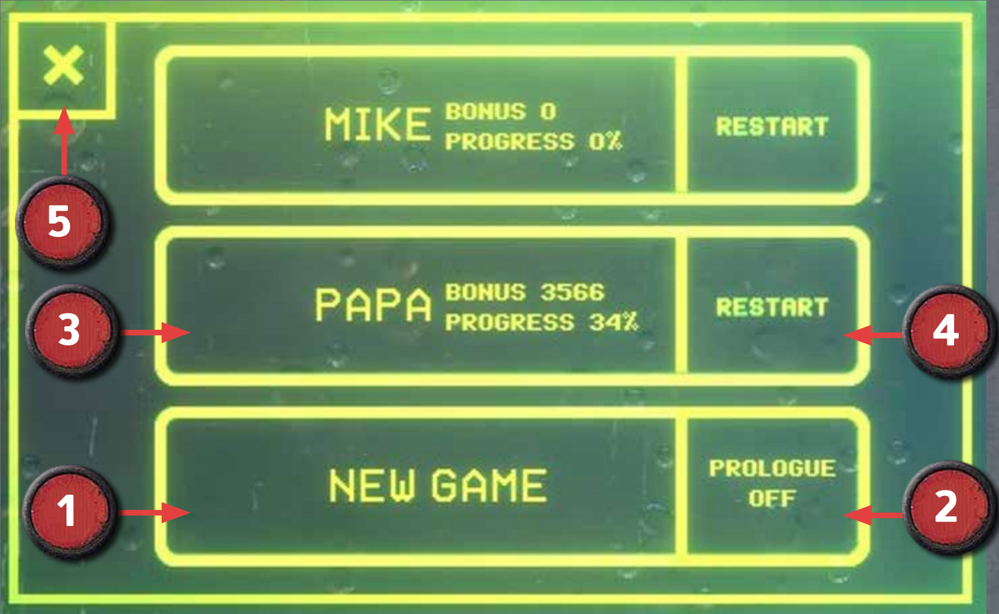

1. **新游戏** - 单击开始新战役。
2. **序章** - 单击启用或禁用序章。序章于主线战役开始前进行。
3. **保存的游戏** - 单击载入存档。存档名为自动生成，进度与累计奖金显示在其侧。
4. **重新开始** - 放弃进度并重新开始战役。
5. **退出** - 单击返回主菜单。

即使您已通读本手册，我们也极其推荐您在第一次游玩时完成序章。除基本教学外，序章还展示了一个精练、自洽，包含原创元素的故事，方便您熟悉本游戏的各方面之余，也将带您直接进入主线战役剧情。

## 战役目标

您的目标看似不难：夺取宏伟的[希瓦][Khiva]城，确保我们对北[格瑞特][Gerat]的控制权，这关乎[帝国][Romani Empire]的生死存亡。然而，无数城市、前哨基地、敌打击群等障碍，正横贯于您与希瓦间的广袤土地上。整场战役犹如一道艰深复杂的谜题，亟待您展现自身的才干与天赋。

粗心冒进的[答剌罕][Tarkhan]或许偏爱他们非凡的战斗技能，意图用实力夺得荣耀；心思慎密的答剌罕则可能冥思苦想，找出最为安全无阻的道路；或许一位天才的工程师会致力于磨砺兵器，改变胜利的天平，又或许一位杰出的领导者将广结盟友，扎根人民，以必胜的信念支撑起势不可挡的舰队。

您选择接过这历史的一棒，您应知帝国的命运握于您的掌中。

## 战役初始舰队选择

开启新战役时，您可以从界面中选择您的初始舰队。

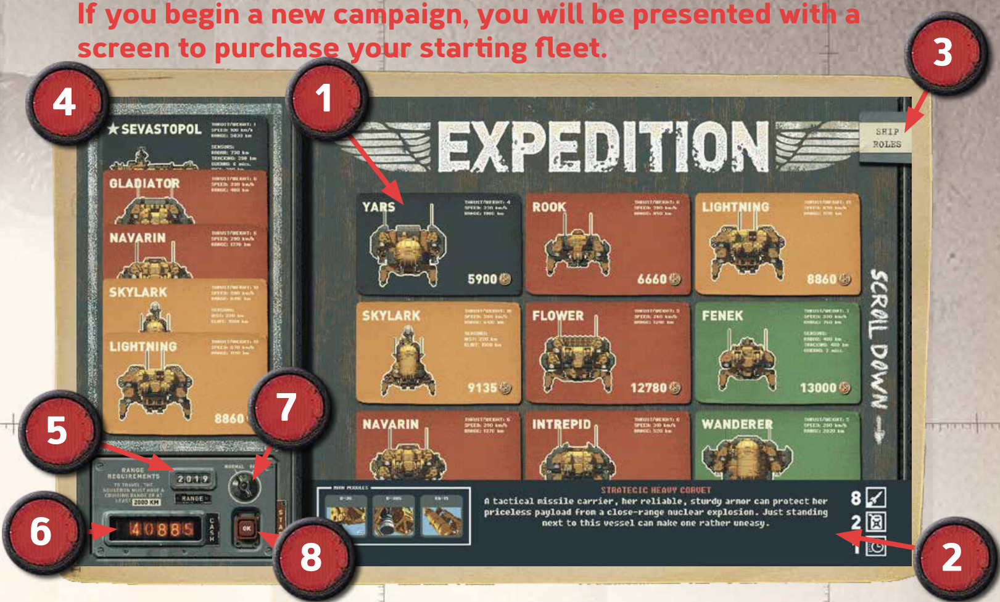

1. **可用舰船** - 鼠标悬停可查看详细信息，单击可将其添加至您的远征舰队，所需价格如其上所示。
2. **舰船详情** - 包含主要模块、描述、和职能评价信息。
3. **舰船职能** - 展开可查看舰船的作战职能。
4. **已选择舰船** - 您舰队当前的构成。单击任意项目可将其移除。
5. **舰队航程** - 您的舰船一同航行时的平均航程，强烈建议令其大于 2000 km。
6. **现金** - 您的剩余资金。[高空舰队][HighFleet]里资金来之不易，且您很快就会需要补给油料和弹药，所以别一下花光了。
7. **难度模式** - 选简单开始。如果您已准备好面对更多更强大的敌人，选困难。
8. **开始** - 一切选择完成后，单击 OK 开始战役。

每种舰船适用于不同职能，如下所示：

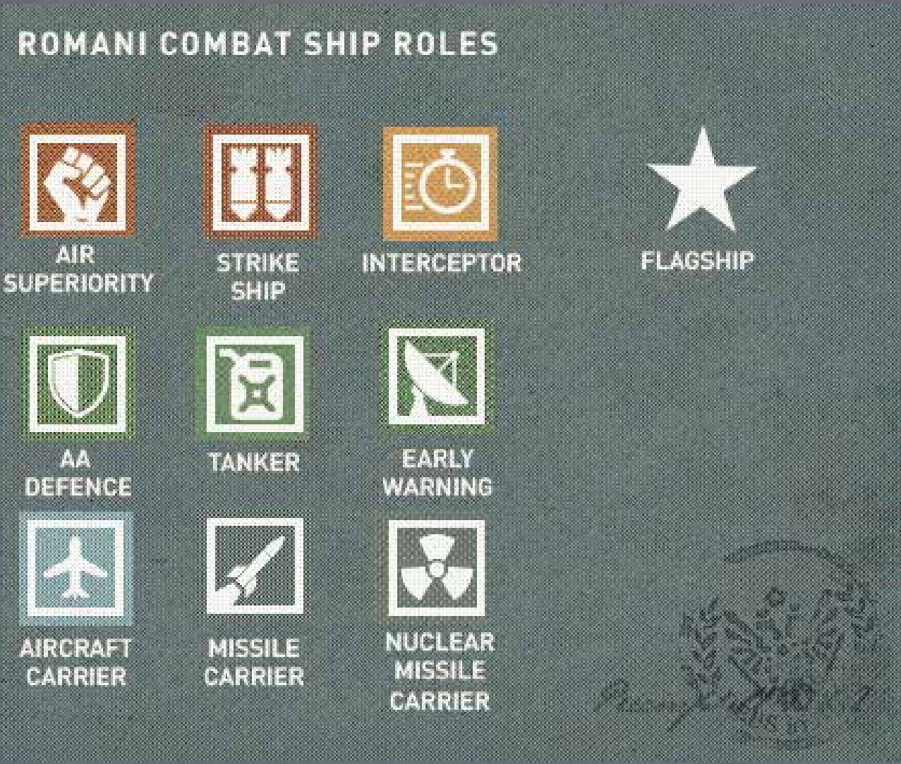

> 译注：从左至右，从上至下

- 空优
- 空袭舰
- 截击舰
- 旗舰
- 防空
- 油轮
- 早期预警
- 航母
- 导弹载舰
- 核导弹载舰

注意您的舰队*必须*包含一艘旗舰，例如[塞瓦斯托波尔][Sevastopol]号。

多试试不同的舰船选单。前期选一支进攻型舰队会很方便，但也别忘了一些舰船有着更加难以上手的优点，以及各种多样化的功能。欲了解更多标配舰船的信息，请参阅手册末尾的列表。您也可以购买您在舰船编辑器创建的自定义舰船。

## 游戏概览

[高空舰队][HighFleet]包含多种不同的游戏风格，它们会交织出现在一整场战役中。您的主要任务包括：

- 规划路线，抓住机遇，规避威胁。
- 通过截获并解码信息来收集情报。
- 与角色互动，处理关系，招贤纳士。
- 在城市执行棘手的着陆。
- 管理您舰队的补给，维护和升级。
- 在致命的空战中交锋。

每种任务需要不同的技能。其中某些重要性不高，但若想获得更加完美的胜利，最好能样样精通。

最后的忠告是，[答剌罕][Tarkhan]，我们总归活在商业中，您免不了为燃料和不时的维护破费。金钱来之不易，因此精打细算、尽可能搜刮资源是最好不过。否则，您也许将不得不出售弹药乃至舰船零件，才付得起到下一城市的燃料费用！

> 提示：战役开始时，您就已经在[乌尔][Ur]着陆了——单击离开船舱手柄即可进入城市，为接下来的旅程购买燃料和特殊弹药。

## 地图界面

### 地图概览

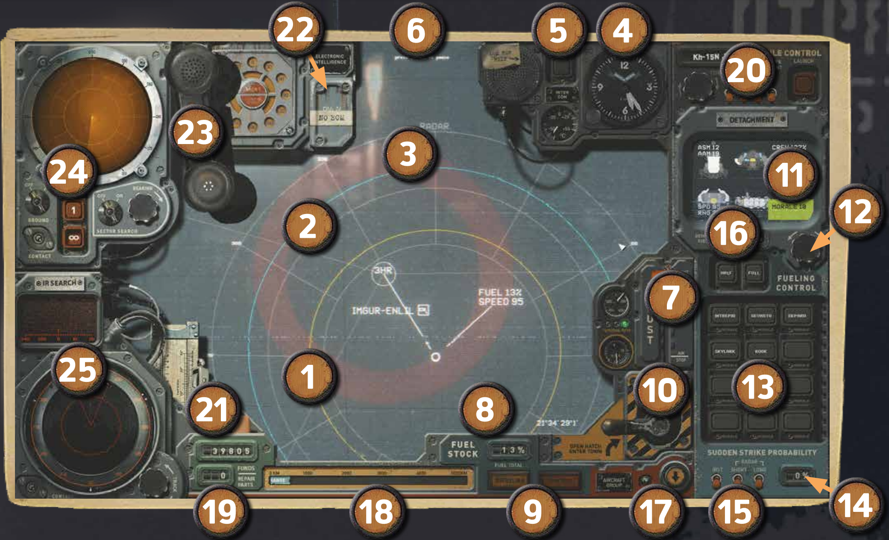

战役的一切基于您的地图界面，尽管称为“地图”，该界面提供的战略工具可不止于此。作为一名睿智的[答剌罕][Tarkhan]，请善用它们。

1. **舰队** - 您当前所在位置。黄圈是您的*对敌跟踪范围*——来自目视和可能配备的雷达（注意雷达的探测范围可以比此更大，参见[*雷达系统*](#雷达系统)章节）。
2. **燃料续航** - 蓝圈是您当前燃料可以航行的范围。
3. **地点** - 贸易路线上的城市或前哨基地。其名称后的图标标示着您可以在此获取的东西，鼠标悬停可以查看更多信息。
4. **时钟** - 当前时间。暂停时不会走动，时间加速时快速转动。
5. **内话** - 单击以与您的盟友对话并获取援助。
6. **暂停状态** - 指示您是否暂停了游戏
7. **推力** - 您设定的舰队航速——例如，您或许希望低速飞行以规避巡逻的敌人，保持特定防御阵型，或在某地点悬停。注意，低于巡航速度飞行时燃料效率更低。
8. **燃料量** - 当前燃料量
9. **加油/维修指示器** - 您在城市安排了维修或加油时闪烁。离开城市前请确保您时间加速至该指示器熄灭为止。
10. **离开舱室** - 单击以在当前城市着陆，或在着陆后重新进入城市。
11. **舰船** - 默认显示您的整支舰队及其士气。当您选择了某个打击群时显示该集群的信息。当您在某艘船上悬停时只显示该船信息。
12. **燃料分配旋钮** - 分离打击群时微调燃料量（参见下方 *16*)。
13. **当前打击群** - 单击此处任意舰船可将其加入一可从主舰队分离的打击群，详见[*独立打击群*](#独立打击群)章节。当某艘船的士气低落时其下方的灯会显示黄色，士气为零时显示红色（此时会拒绝战斗）。
14. **突袭成功率** - 显示当前选择的打击群执行突袭任务的成功率。
15. **突袭模拟** - 选择其中选项可查看在敌人配有此类传感器时执行突袭任务的成功率。
16. **燃料分配选择** - 从舰队分离舰船时，选择**空**会令分离的舰船不携带燃料，延长其余舰船的航程。选择**满**会尽可能为被分离的舰船填充燃料。默认的燃料分配会尽量让双方航程相同。
17. **航空器控制** - 单击展开航空器坞——仅当舰队中有航母时可用。详见[*航空器起飞控制*](#航空器起飞控制)。
18. **航程** - 满燃料以及当前燃料下您可以航行的距离。
19. **资金** - 您剩余的现金和维修备件。
20. **导弹控制** - 发射远程导弹。详见[*战术导弹控制*](#战术导弹控制)。
21. **标注工具袋** - 用于标记敌人可疑动向的各类工具，详见[*标注*](#标注)。
22. **雷达干扰机** - 舰队配有电子干扰（ECM）时，单击开关雷达干扰机。详见[*雷达防御*](#雷达防御)。
23. **通信截获** - 检测到敌人通信传输时点亮。单击展开电台——详见[*通信传输*](#通信传输)。
24. **雷达系统** - 详见[*雷达系统*](#雷达系统)。
25. **红外搜索与跟踪系统** - 详见[*红外探测*](#红外探测)。

牢记这些特殊操作可以改善您在地图界面的体验：

- 按下 `空格` - 暂停/解除暂停，便于您规划下一步行动。
- 长按 `Shift` - 时间加速，减少加油、维修和航行时的等待。
- `鼠标滚轮` - 缩放地图，高放大倍数下会显示带有天气状况、燃烧的火焰等的真实卫星图像。
- 当您刚从城市返回地图时，别忘了您规划的加油与维修都需要时间——解除暂停，时间加速以跳过等待！

### 移动

移动时，请确保您已经选中您的主舰队（选中的舰队圆形图标会呈白色，默认选中主舰队），然后右键单击地图上任意一点即可。您应只选择蓝圈所示的航程内的目的地。通常，您的目的地会是城市或前哨基地，但并不尽然……

当您移动多个打击群时（参见[*独立打击群*](#独立打击群)），您的主舰队可能失去选中状态，其圆圈图标变为黄色——左键单击即可重新选中它。

尽管您的目标是遥远北方的[希瓦][Khiva]，您仍需积跬步以至千里，在沿途补充燃料，展开战斗，维修舰船。请善用战术与本章所述的工具，规划出最为安全合理的路线。

### 舰队基地（存盘点）

当您攻占某一舰队基地时，游戏会自动创建一个可以手动读取的存盘点。舰队基地在地图上以一颗五角星和软盘保存图标标识。

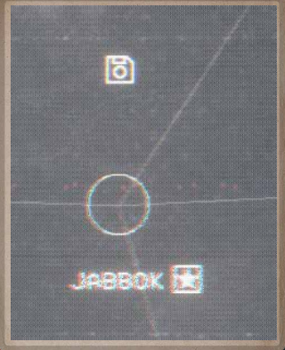

攻占如上图所示的基地之一后，您即可在 `Esc` 菜单中选择载入游戏，回档到所需存盘点。

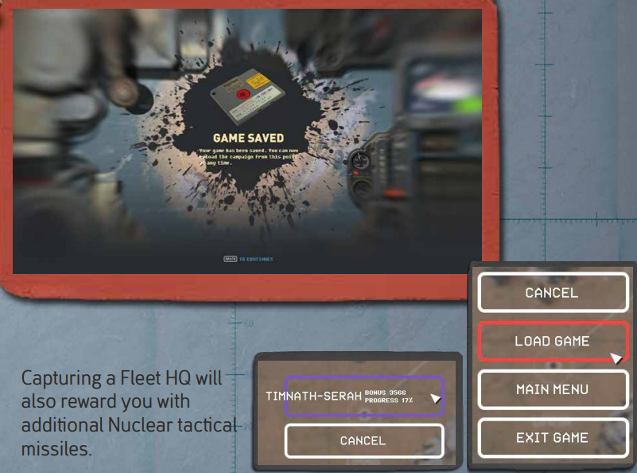

攻占舰队基地还会赠予您额外的核战术导弹。

### 敌人

您面前的地图充斥着藏在暗处的敌人，发现它们时甚至可能为时已晚。每个城市与前哨基地都有卫戍部队等着您，空中也有许多敌人四处游荡。除非您甘愿一头撞进伏击圈，否则还是花点时间侦察或推测它们的位置与行动路线为妙。

敌人上方的黄条表示其战备状态——一旦它倒计时结束消失，敌人就会起飞并尝试追踪您或与您交战。

**敌打击群**是一些全副武装的舰队，它们每天沿着既定路线在城市间航行。倘若您在它们的探测范围内停留过久，它们将发现您的位置并上报最高司令部。接着，附近的敌打击群将向您奔来，足够接近时甚至会倾泻远程导弹。

**运输船**也不断在城市间航行，它们的护卫更为薄弱。截获这些船只往往是为您漫长战役增添资金的不错机会。

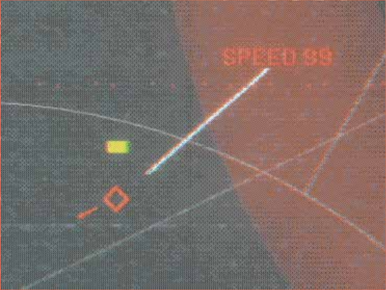

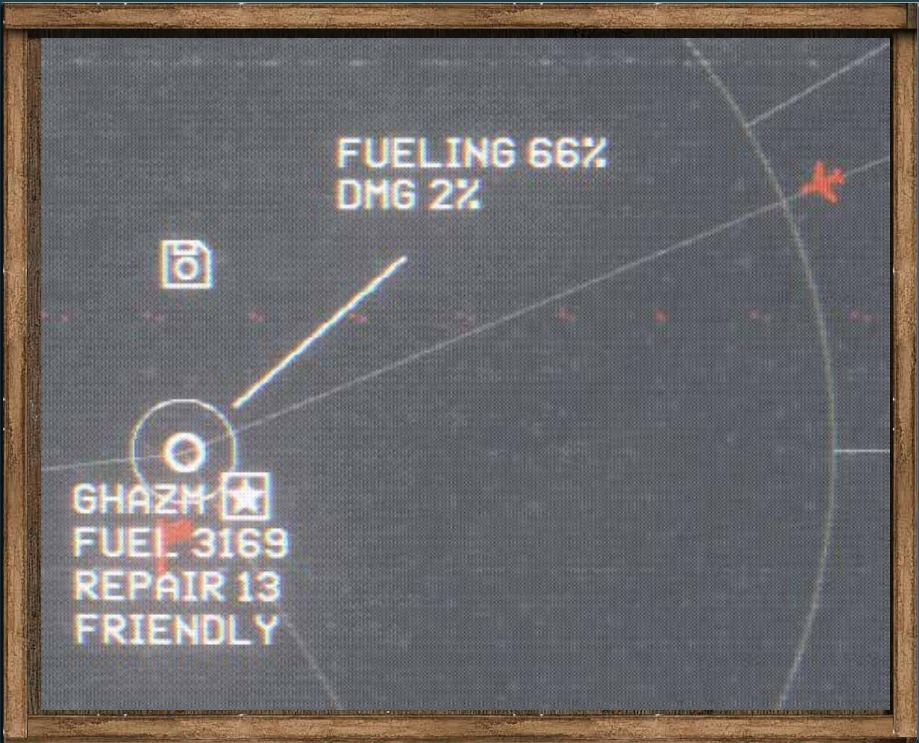

**航母**与**导弹载舰**同样潜伏于地图中。航母能够在 2000km 外放飞攻击机，因此避开或摧毁它们至关重要，否则您就得手动击落那些麻烦的喷气机。导弹载舰也能发起远程打击——导弹临空时，您有一次手动击落它们的机会（如下图所示）。您操控您的旗舰，其他舰船则会自动向导弹射击。

*当心别误击友军！*

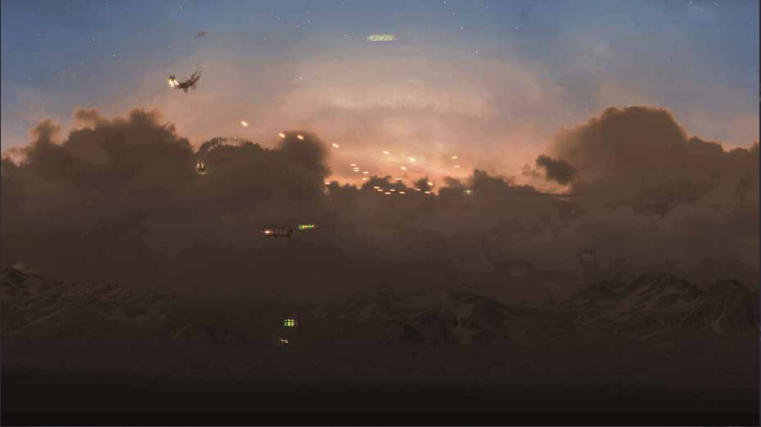

极其建议您尽可能避开敌打击群与其他敌人。最开始您不可能知晓它们的位置，因此地图上它们不可见。然而，您可以逐渐收集线索，在地图上标注出它们可能的位置。收集信息的主要途径是截获敌方的无线电通信传输，其中可能无意透露出它们当前乃至未来的航线——*详见[通信传输](#通信传输)章节*

其他标记敌打击群的方式是攻占敌方对流层散射通信站。地图上分布着数个这样的站点，其中每个都可能提供附近区域的无价情报。当您偶然发现一个通信站时，可以试着派出打击群攻占它。占领并离开后，地图右上角将会出现数条可用的情报消息。

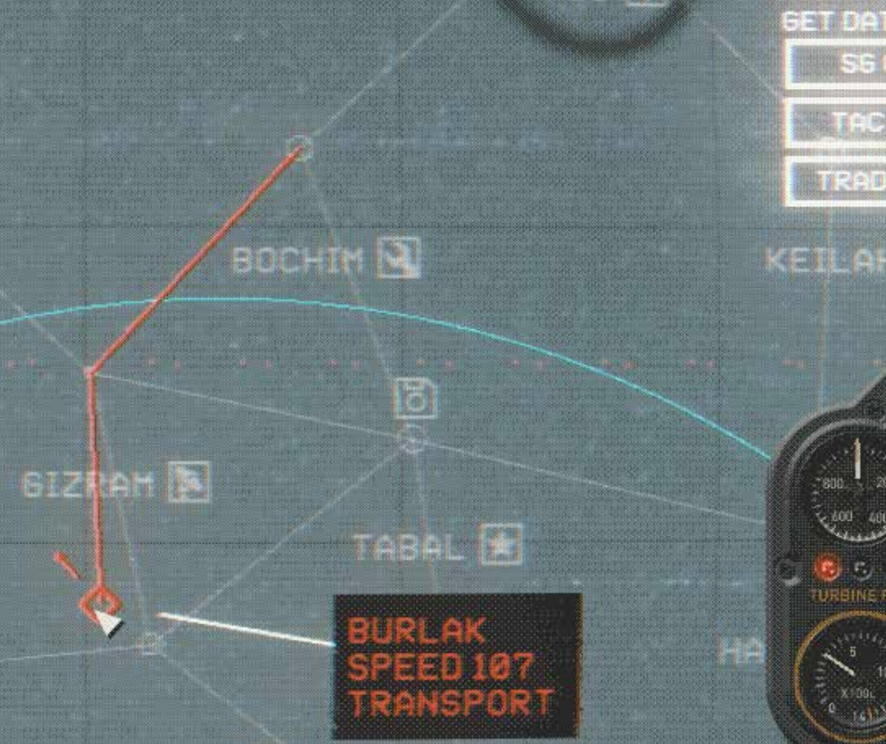

单击任意一种情报类型，可以以情报消息为代价获得此类敌方位置信息（例：SG = 打击群，TAC = 战术资产，Trade = 运输船）。敌方位置将以红色出现在地图上，悬停可查看其路线。如果站点没有此类敌方情报，该操作只会发出一条提示音，而不会消耗情报消息。

当您的主舰队或某个打击群与地图上的敌人、城市或前哨基地接战时，您会进入一个动作游戏式的战斗阶段，此阶段您将直接操纵每艘舰船，击落敌人——*详见[战斗](#战斗)章节*。

### 雷达系统

您舰队的雷达系统时刻警惕着周边的敌人。雷达设备昂贵脆弱，因此合理的做法是将其安装在几乎不直接参加战斗的专用舰船，例如预警或侦察舰上。您还可以利用沿途获得的组件升级您的舰船，扩展雷达的探测范围。

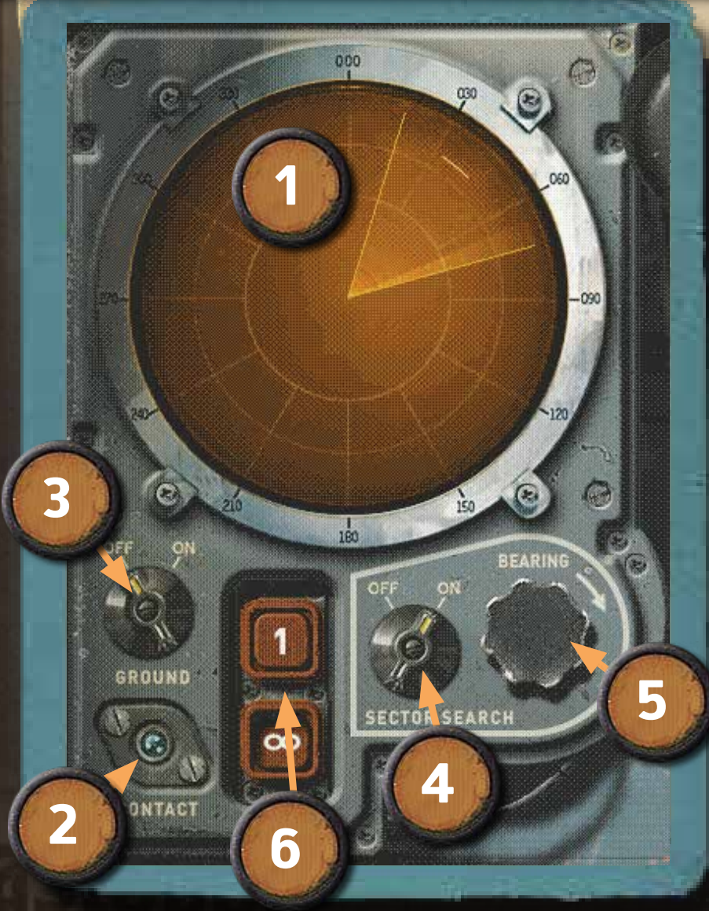

1. 雷达输出 - 在此示例中，我们使用扇区搜索模式在 30°-60° 网格较远处发现了一敌方目标。
2. 截获指示器 - 截获敌方目标时以蓝色闪烁。
3. 切换对地 - 切换对空或对地雷达。
4. 扇区搜索 - 切换 360° 搜索或 60° 扇区搜索。
5. 方位 - 使用鼠标滚轮以顺时针或逆时针旋转搜索扇区。
6. 扫描频率 - 默认设置为持续扫描，但当您单击“1”按钮时，雷达将执行单次扫描后停止。您亦可以手动关闭自动扫描，以完全关闭雷达（以免敌方发现您——*详见[雷达防御](#雷达防御)章节*）。之后您想使用雷达前记得将其设回持续扫描。

发现敌人时，雷达将目标显示为屏幕上的一条短细线，如上图所示。线的中点即为敌方位置。雷达屏幕上显示的网格会按相同比例显示在地图上。下图即为前文中示例的地图视角，一个自定义标注（X）大致标出了雷达屏幕显示的敌人位置。

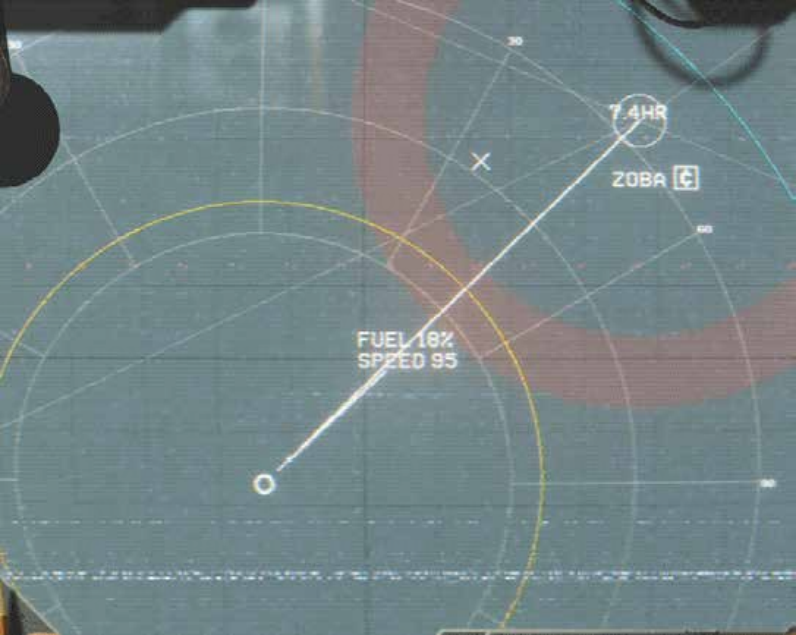

> 注意一旦敌人进入您的跟踪范围（黄圈），您即可直接获得它们的实时位置。

雷达探测很有用，您的标注工具则能分析出更多数据，让它更有用（*详见[标注](#标注)章节*）。您可以先标出敌方初始位置，等待一小段时间，再标注敌方位置并测量二者的距离。欸，现在简单一算就得到了敌方速度和航向！

如果敌方速度大于 600km/h，则肯定是飞机或导弹；如果速度在 100km/h 上下，则大概率为大型舰船。随着时间推移，您会逐渐掌握面对不同威胁的迎击技巧以及明智的行动模式。

### 雷达防御

### 红外探测

### 通信传输

### 标注

### 独立打击群

### 突袭

### 坠毁地点

### 航空器起飞控制

### 战术导弹控制

### 内部通信

## 对话

### 关系指标

### 招纳

## 着陆

## 城市

### 补给

### 船厂

### 增援

## 战斗

### 作战计划

### 战场

### 胜败

### 晋升

## 舰船编辑器

## 标准舰队数据

## 译注：名词对照

### 格瑞特

[Gerat]: #格瑞特 "Gerat"

Gerat, 广袤的沙漠地区，战役故事的发生地

### 大灾变

[Catastrophe]: #大灾变 "Catastrophe"

Catastrophe, 遥远时代改变世界的一场大灾难

### 埃塞

[Isi]: #埃塞 "Isi"

Isi

### 穆阿利斯

[Mualis]: #穆阿利斯 "Mualis"

Mualis

### 萨勒姆

[Salem]: #萨勒姆 "Salem"

Salem

### 伊利亚

[Iliya]: #伊利亚 "Iliya"

Iliya

### 罗姆

[Romani]: #罗姆 "Romani"

Romani, 亦常译作罗马尼，此处取现实中罗姆人一词翻译

### 埃拉特

[Elaat]: #埃拉特 "Elaat"

Elaat

### 卡鲁

[Kharu]: #卡鲁 "Kharu"

Kharu

### 罗姆帝国

[Romani Empire]: #罗姆帝国 "Romani Empire"

Romani Empire

### 萨亚迪

[Sayadi]: #萨亚迪 "Sayadi"

Sayadi

### 大贵族

[Great Houses]: #大贵族 "Great Houses"

Great Houses

### 可汗

[Khans]: #可汗 "Khans"

Khans

### 埃劳-阿里

[Elaou-Ali]: #埃劳-阿里 "Elaou-Ali"

Elaou-Ali

### 克里姆沙阿二世

[Kerim Shah II]: #克里姆沙阿二世 "Kerim Shah II"

Kerim Shah II

### 希瓦

[Khiva]: #希瓦 "Khiva"

Khiva, 格瑞特北端的城市

### 大贵族会盟

[the Gathering of Great Houses]: #大贵族会盟 "the Gathering of Great Houses"

the Gathering of Great Houses

### 会盟战争

[the Gathering War]: #会盟战争 "the Gathering War"

the Gathering War

### 答剌罕

[Tarkhan]: #答剌罕 "Tarkhan"

Tarkhan, 各草原民族常用的官号，专指统兵武将

### 贾基尔

[Jharkil]: #贾基尔 "Jharkil"

Jharkil

### 高空舰队

[HighFleet]: #高空舰队 "HighFleet"

HighFleet, 赞美神奇的 Konstantin Koshutin，感谢他们创造出如此奇妙的故事与世界

### 塞瓦斯托波尔

[Sevastopol]: #塞瓦斯托波尔 "Sevastopol"

Sevastopol，[罗姆帝国][Romani Empire]舰队重型战略[巡空舰][Cruiser]，舰队旗舰。

### 巡空舰

[Cruiser]: #巡空舰 "Cruiser"

Cruiser，考虑世界观背景，译为巡空舰。

### 乌尔

[Ur]: #乌尔 "Ur"

[格瑞特][Gerat]南方的城市，战役出生点。
